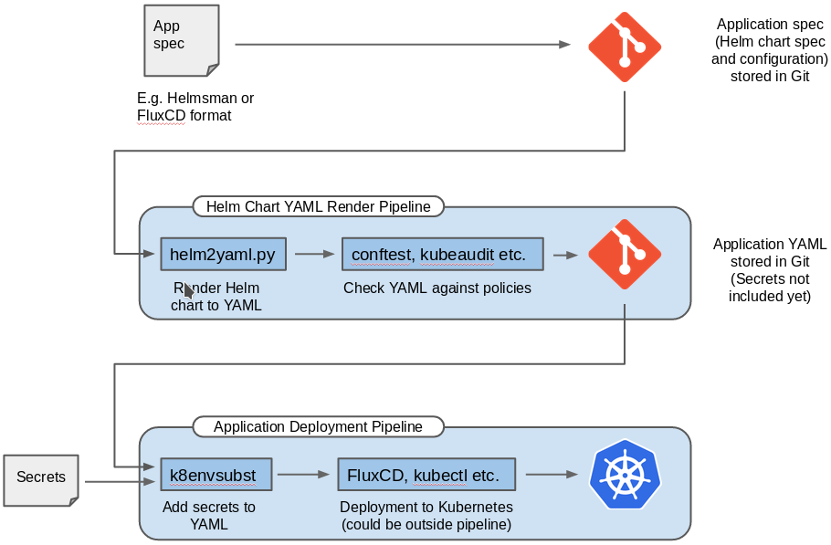

## Kubernetes application deployment utilities

This repository contain tools for implementing GitOps with Helm.

## TL:DR

The shortcomings of `helm template` are:

- It does not support Helm hooks. This means too many resources are rendered.
- The order of resources within a given Kubernetes kind is random and changes between different helm invocations. This break GitOps diff.
- All resources are rendered into one output which makes it difficult to seal secrets.
- Resources do not have their namespace explicitly set unless the chart does this itself.
- Helm does not have a declarative spec for application configuration (e.g. like Helmsman or Helmsfile)

The tool `helm2yaml` have solutions for these issues.

## Introduction

With `helm install` the Kubernetes resource YAML is not retained outside of
Kubernetes. This is an anti-pattern in CI/CD, where we strive to separate the
application building, packaging and running stages.  With Helm-based GitOps we
should consider the Helm-to-YAML process as a separate process from the actual
deployment. The YAML resulting from running `helm install` is the result of the
helm chart version, the Kubernetes API capabilities, whether the chart was
installed already and the values we specify for the configuration. With all
these moving parts, the resulting YAML should be retained similarly to how we
retain the binary artifact from source-code compilation.

Kubernetes PodSecurityPolicies allow specifying policies for applications we
deploy to Kubernetes.  With CI/CD we try to 'shift-left', i.e. perform
validation early and fail early. With Helm, the application deployment will not
fail until it has been deployed to Kubernetes. A better alternative is to
complement PodSecurityPolicies with pre-deployment validation with
e.g. (conftest)[https://github.com/instrumenta/conftest],
(kubeaudit)[https://github.com/Shopify/kubeaudit] or similar tools.

The `helm2yaml` tool reads [Helmsman](https://github.com/Praqma/helmsman) and
[FluxCD](https://fluxcd.io/) Kubernetes applications specs and allows for
running Helm2 or Helm3 to render the resulting application Kubernetes resource
YAMLs. This allows for keeping an audit trail on the actual YAML deployed
to Kubernetes.

### GitOps

While using Helm to deploy applications directly onto a Kubernetes cluster is
very common it is also a cloud-native anti-pattern IMHO. Using Helm this way
means that Helm on-the-fly renders the final YAML which are deployed to the
cluster and this YAML is not retained in any other places than in the cluster.

For exactly the same reasons as why we build containers, the resulting YAML
should be retained as an artifact such that we both have an audit trail for what
was actually deployed and such that we can be sure we can re-deploy the
application without having to re-run Helm to re-render the YAML.

With the helm2yaml tool, the final YAML will be written to file named from the
Helm release name. With a Helmsman application spec, the YAML can be rendered as
follows>

```
helm2yaml.py helmsman -f helmsman-app-spec.yaml
kubectl apply -f final-app.yaml
```

Similarly with FluxCD application specs:

```
helm2yaml.py fluxcd -f fluxcd-app-spec.yaml
kubectl apply -f final-app.yaml
```

and here `final-app.yaml` could be retained for the audit trail.  If the final
YAML is retained in e.g. git, the `kubectl apply` command could be replaced by
deployment on Kubernetes with Flux in a non-Helm mode, i.e. GitOps with an audit
trail.

### Helmsman Replacement

The script `helmsman.sh` is a script that implements some of the Helmsman
functionality, i.e. Helmsman application installation can be imitated with `helm2yaml` and `kubectl`

E.g.:

```
helmsman --apply -f app.yaml
```

can be replaced with:

```
helmsman.sh --apply -f app.yaml
```

Note that `helmsman.sh` use a Helm hook filter to only render ordinary resources
and ignore e.g. test resources etc. See notes on hooks below.

#### Handling Secrets

If the application deployment contains secrets which should not be included in
the rendered YAML, these secrets could be injected at the YAML deployment stage
using e.g. `envsubst`. Note however, that `envsubst` replace all environment
variable occurrences and e.g. shell scripts being passed into configmaps could
have environment variables wrongly replaced (potentially with empty
strings). The Grafana test that is part of the Grafana Helm chart is an example
of such a situation. If `envsubst` us used, the specific variables that should
be replaced should be specified as part of the `envsubst` invocation.

**Beware, that secrets have values base64 encoded, i.e. substituting environment
  variables in Kubernetes secrets is not readily possible with `envsubst`.**
  
To work-around this, use the `k8envsubst.py` utility - see the `helmsman.sh`
Helmsman-replacement script for how to do this. The `k8envsubst.py` utility also
replaces only defined environment variables, i.e. it does not break shell
scripts in configmaps.

#### GitOps Application Deployment Pipeline

A GitOps pipeline example is shown below:



### YAML Audit

Before the final YAML is deployed to a Kubernetes cluster, it can be validated
using e.g. [conftest](https://github.com/MichaelVL/kubernetes-rego-tests). E.g.

```
# First render the final YAML based on a Helmsman application spec
$ mkdir rendered
$ docker run --rm --user `id -u`:`id -g` -e HOME=/tmp/home -v $PWD:/src -v $PWD/rendered:/rendered michaelvl/helm2yaml helmsman -f examples/prometheus.yaml
# Then run conftest/Rego-based audits to validate the YAML
cat rendered/prometheus.yaml | docker run -i --rm michaelvl/conftest-kubernetes | grep FAIL
```

This will produce errors like the following:

```
FAIL - prometheus-server in the Deployment prometheus-server does not have a memory limit set
FAIL - prometheus-server in the Deployment prometheus-server doesn't drop all capabilities
FAIL - prometheus-server in the Deployment prometheus-server is not using a read only root filesystem
FAIL - prometheus-server in the Deployment prometheus-server is running as root
```

which can be used to fail the GitOps pipeline for the application deployment.

### Using Other Helm Binaries

To use an alternative Helm binary, e.g. helm3, one could specify the Helm
command as follows:

```
helm2yaml.py -b ~/bin/helm3 helmsman -f my-app.yaml
```

### Running from a Container

The helm2yaml tool is available as a container, e.g. see the `helmsman.sh`
Helmsman-replacement script.

### Integrating with Sealed Secrets

[Sealed Secrets](https://github.com/bitnami-labs/sealed-secrets) is a mechanism
that allows encryption of secrets such that they can be stored in git and only
decrypted inside a Kubernetes cluster by a sealed-secrets controller. This
requires sealing of secrets and to support this usecase, the `helm2yaml` tool
allows rendering secrets into a separate file. See the `--separate-secrets` and
`--separate-with-ns` arguments.

Note, however, that the sealed-secrets encryption algorithm includes a [random
session
key](https://github.com/bitnami-labs/sealed-secrets/blob/master/docs/crypto.md)
in the encrypted material, which means there will always be difference in the
sealed secret even though no change was made to the unsealed secret. Using
methods like keeping a checksum of the original secret to detect changes is not
recommended since it may leak secret data.

There is currently no known mechanism for this issue without potentially
compromising secure data. See also [this sealed-secrets
issue](https://github.com/bitnami-labs/sealed-secrets/issues/131).

### List Images

The helm2yaml tool can also be used to list images used in a Helm chart to allow
e.g. pre-pulling of images.  Use the `--list-images` option for this.

### Helm Hooks

Helm have [hooks](https://helm.sh/docs/charts_hooks/) that allow different
actions at different points in a charts life-cycle. This basically means that
different resources are created at different times, e.g. resources annotated
with `pre-install` are created before the ordinary resources. To support this,
`helm2yaml` allows filtering resources with hooks such that e.g. separate
pre-install, ordinary and post-install resources can be rendered to three
different YAML files by running `helm2yaml` three times with different filtering
settings. Use `--hook-filter` to specify filtered resources. Hook filters are
values to compare to the value of annotation `helm.sh/hook`. An empty string
matches resources with no such annotation.

### Sorting Resources

Helm sorts resources by kind, however, Helm does not sort resources of the same
kind, and in some cases the order of resources output from `helm template` may
change.  E.g.:

```
$ helm3 version
version.BuildInfo{Version:"v3.0.2", GitCommit:"19e47ee3283ae98139d98460de796c1be1e3975f" ...
$ helm3 template --version "0.12.0" --repo "https://kubernetes-charts.storage.googleapis.com" metallb >m1
$ helm3 template --version "0.12.0" --repo "https://kubernetes-charts.storage.googleapis.com" metallb >m2
$ diff -q m1 m2
Files m1 and m2 differ
```

This is not ideal in a render pipeline and to mitigate this, `helm2yaml` by
default sorts resources of the same kind on their name. This results in a
consistent output from `helm2yaml` which does not change between different
invocations.  This feature can be disabled using the argument `--no-sort`.

### Automatic API Upgrade

In Kubernetes 1.16.0 several APIs versions where deprecated. By using
`--auto-api-upgrade`, the `helm2yaml` tool can automatically upgrade API
versions.

### Running Container as Non-Root

When using `helm2yaml` as a container with Helm3, the `HOME` environment
variable should be set to a path write-able by the user UID used within the
container. This is due to Helm3 using the HOMe environment variable for location
of configuration.

### Notes

`helm template` ignores namespace, i.e. the namespace is not included in the
rendered YAML. To support this, the `helm2yaml` tool renders a namespace
resource and allows separating resources into those who have an explicit
namespace specification and those who do not. See the
`--separete-with-namespace` argument.  Applying rendered YAML with `kubectl`
should use an explicit namespace argument - see the `helmsman.sh`
Helmsman-replacement script for an example on how to do this.

Using `helm template` validates the YAML according to the default set of API
versions. This might not suffice for some charts and thus additional APIs could
be enabled with the `--api-versions` argument - see the `helmsman.sh`
Helmsman-replacement script for examples.

Helm2 does not accept repository on the `template` action, i.e. it is generally
recommended to use helm3.

With Helm applying resources to Kubernetes, a full diff will be applied
according to the deployed chart, i.e. if subsequent versions of a chart remove
resources, these will be deleted from Kubernetes. A render-and-run-kubectl
approach will thus not delete resources removed between different chart
versions. Allowing Helm to delete resources is probably also not a good idea in
production environments!

Dependencies (requirements.yaml in a chart) are handled properly.

Helm use [hooks](https://github.com/helm/helm/blob/master/docs/charts_hooks.md)
to deploy groups of resources at different points in the deployment life-cycle,
e.g. a resource with an `helm.sh/hook` annotation containing `post-install`
means that this resource should be deployed after the main resources. With `helm
template` the hook state-machine is not available and resources that normally
would not be deployed might be deployed (e.g. test resources).